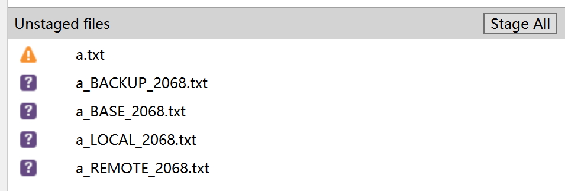
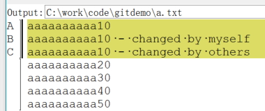

# 外部 Merge 工具

## 系统默认下的行为

默认情况下 sourcetree 是没有配置 external merge tool 的，即 "Tools" -> "Options" -> "Diff" 下面的 external merge tool 设置为 "System Default"

在发生 merge 冲突时，选 "Resolve Conflicts" -> "Launch External Merge Tool"，确认之后得到的 merge 结果如下：

这里生成了多个文件(每个文件后缀中的数字,如这里的2068,可以不理会,应该只是为了避免重名)：

- `a_BACKUP_####.txt`: 自动 merge 完成之后的备份文件，里面的内容和 a.txt 一致
- `a_LOCAL_####.txt`: merge操作中该文件的本地版本
- `a_REMOTE_####.txt`：merge操作中该文件的远程版本
- `a_BASE_####.txt`: merge操作中该文件的本地版本和远程版本的基线版本

### BASE 的概念

这里重点解释一下 BASE 的概念，下图是我们正在进行的 merge (由 pull 操作触发)：

图上可以看到两次的 commit，正是这两次 commit 修改了同一个文件的同一行，造成了我们现在面临的代码冲突。我们来看两次提交的信息，注意红框的内容：

我们会发现这两次提交的 parent 都是 "6264ef115a"，这点从图形上也可以非常明显的体现出来，在 "6264ef115a" 这次提交之后，图形发生了一个分叉。然后我们现在又试图将这个分叉合并回来。

下图是图形上各个 commit 所表示的圆点和 merge 操作时的 LOCAL/REMOTE/BASE 概念的对应关系：

在 merge 的时候，一个至关重要的事情是：我们需要了解到底 merge 的两边分别做了什么改动，然后我们才能决定最后需要保留的内容。

这点体现在 merge tool 的工作原理上：

- LOCAL 和 REMOTE 可以从 merge 操作的两个分支上直接获取到，非常简单
- BASE 就需要推导，从 LOCAL 和 REMOTE 开始向前推，检查parent，直到两边的 parent 指向同一个 commit，这就得到了 BASE
- 然后， LOCAL 和 BASE 做一次 diff 操作，就知道 LOCAL 这边做了什么改动；同理 REMOTE那边做一次 diff
- 将两次 diff 的结果呈现给用户，以便用户判断和选择

## 使用 external merge tool

我们继续前面的话题，在没有配置 external merge tool 时，sourcetree 只能简单的生成各个文件（BASE/LOCAL/REMOTE等)，而无法给出一个友好的图形界面。

我们现在开始介绍如何使用 external merge tool

### kdiff3

再使用前请先安装 kdiff3，详细介绍见前面的 ["设置"](settings.md) 一节。

然后修改配置, "Tools" -> "Options" -> "Diff" , external merge tool 设置为 "KDiff3".

我们再次进行merge，选 "Resolve Conflicts" -> "Launch External Merge Tool"，sourcetree 会调用kdiff3， 然后提示如下：

Kdiff 以这样的图形界面来展示文件冲突的情况：

- 第一排的三个窗口分别是 BASE / LOCAL / REMOTE
- 第二排的窗口显示的是当前merge的结果，其中发生冲突的地方显示为 `<Merge Conflict>`

右键点冲突点所在的 `<Merge Conflict>`，弹出选择框：

在这里可以方便的选择希望 merge 后保留的内容。特别提醒，可以选择ABC中的一个或者多个! 如图我选择了A/B/C三个：

也可以在这个基础上自行修改，比如我修改为保留BC两者的合集：

保存，退出kdiff3，回到本地文件系统，看到 merge 的结果：

好消息是原来的 BASE/LOCAL/REMOTE/BACKUP 文件都被清理掉了，工作区现在干净了很多。坏消息是还是生成了一个 `*.orig`

> 注: 为了避免将.orig 文件提交到git仓库，请修改 .gitignore 文件，增加一行，内容为 `*.orig`
> 或者干脆就不生成这个备份文件:
> git config --global mergetool.keepBackup false

## commit并push

完成冲突的处理之后，就可以再次commit然后push到远程仓库了，此时 sourcetree 的显示如下：

